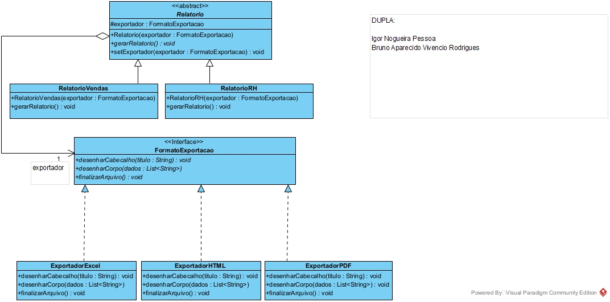
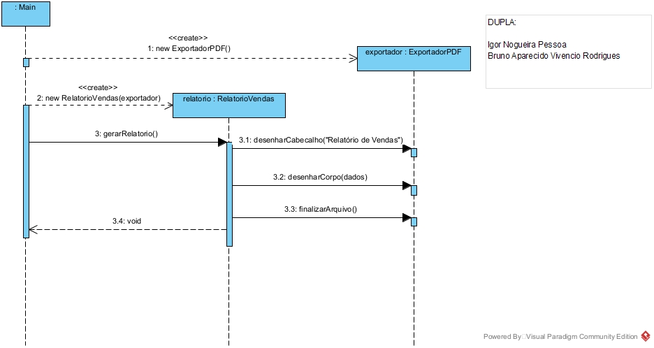

# Padrão de modelagem de projetos Bridge - FASE 2

**Dupla:**  Bruno Aparecido Vivencio Rodrigues e Igor Nogueira Pessoa

## 1. Contexto do problema

O sistema legado da TechFatec gerava apenas o *Relatório de Vendas* em *PDF*. O novo requisito
adiciona o *Relatório de Desempenho de RH* e exige que **todos** os relatórios, atuais e futuros,
sejam exportáveis para **PDF, Excel (XLSX) e HTML**.

Com herança pura, cada combinação tipo × formato viraria uma subclasse
(`RelatorioVendasPDF`, `RelatorioVendasExcel`, `RelatorioRHHTML`...). Hoje já seriam
2 × 3 = 6 classes, e cada novo relatório ou formato multiplicaria esse número. Esse problema
é a **explosão de subclasses**.

## 2. Aplicando o Padrão Bridge

O Bridge separa uma abstração da sua implementação, para que as duas variem de forma independente.
O sistema fica dividido em duas hierarquias ligadas por uma **agregação** (a "ponte"):

| Papel no Bridge          | Classe(s)                                           | Pacote            |
|--------------------------|-----------------------------------------------------|-------------------|
| Abstraction              | `Relatorio` (abstrata)                              | `abstracao`       |
| Refined Abstraction      | `RelatorioVendas`, `RelatorioRH`                    | `abstracao`       |
| Implementor              | `FormatoExportacao` (interface)                     | `implementacao`   |
| Concrete Implementor     | `ExportadorPDF`, `ExportadorExcel`, `ExportadorHTML`| `implementacao`   |
| Client                   | `Main`                                              | `cliente`         |

Com essa divisão, o sistema precisa de **2 + 3 = 5 classes concretas** em vez de 6. A diferença
cresce a cada item novo: 3 relatórios × 4 formatos exigiriam 12 subclasses com herança, contra
7 classes com o Bridge.

## 3. Diagramas

### Diagrama de Classes


### Diagrama de Sequência


O fluxo do diagrama de sequência é o seguinte:
1. `Main` instancia o exportador concreto (`ExportadorPDF`).
2. `Main` instancia o `RelatorioVendas` e injeta o exportador pelo construtor.
3. `Main` chama `gerarRelatorio()`.
4. O relatório delega ao exportador: `desenharCabecalho()` → `desenharCorpo()` → `finalizarArquivo()`.

## 4. Decisões técnicas

### Injeção de Dependência via construtor
As classes de relatório **nunca** usam `new` para criar um exportador concreto. Elas dependem
apenas da interface `FormatoExportacao`, recebida no construtor. Assim cumprimos o
**Princípio da Inversão de Dependência (DIP)**: módulos de alto nível dependem de abstrações,
não de implementações.

### Troca de formato em tempo de execução
O método `setExportador(FormatoExportacao)` permite trocar a implementação de um objeto que já
existe, sem recriá-lo. A Rotina 2 do cliente demonstra isso.

### Princípio Aberto/Fechado (OCP)
- **Novo formato** (ex.: CSV): basta criar `ExportadorCSV implements FormatoExportacao`.
  Nenhum relatório é alterado.
- **Novo relatório** (ex.: Financeiro): basta criar `RelatorioFinanceiro extends Relatorio`.
  Ele já nasce compatível com todos os formatos existentes.

O código fica aberto para extensão e fechado para modificação.

### Separação física de diretórios
`src/abstracao`, `src/implementacao` e `src/cliente` são pacotes Java distintos. Isso reforça
na estrutura do projeto a separação entre as duas hierarquias do Bridge.

## 5. Como executar

Requisito: Java 11+

```bash
javac -encoding UTF-8 -d out src/implementacao/*.java src/abstracao/*.java src/cliente/*.java
java -cp out cliente.Main
```

## 6. Script de validação

A classe `cliente.Main` executa três rotinas:
1. Gera o **Relatório de Vendas em PDF**.
2. Troca o formato **do mesmo objeto** para **Excel** em tempo de execução e gera de novo.
3. Gera o **Relatório de RH em HTML**.